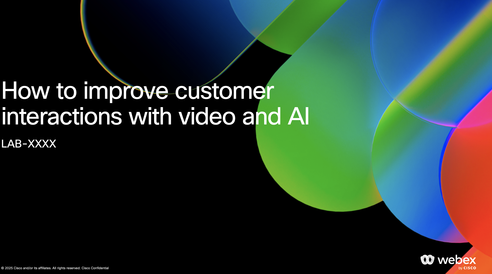
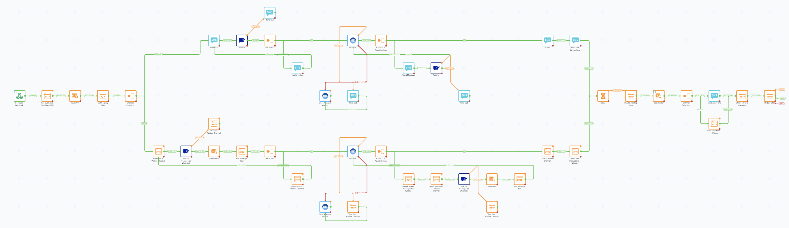

# Introduction

Welcome to the **How to improve customer interactions with video and AI** hands-on lab!

    

## Objectives

At the end of this lab, you should be able to build a Webex Connect flow, ready to be used for a real business use case.

    

In the process, you will:
- Learn about Instant Connect and APIs
- Learn advanced Webex Connect integration and messaging capabilities
- Learn how to build a Webex AI Agent
