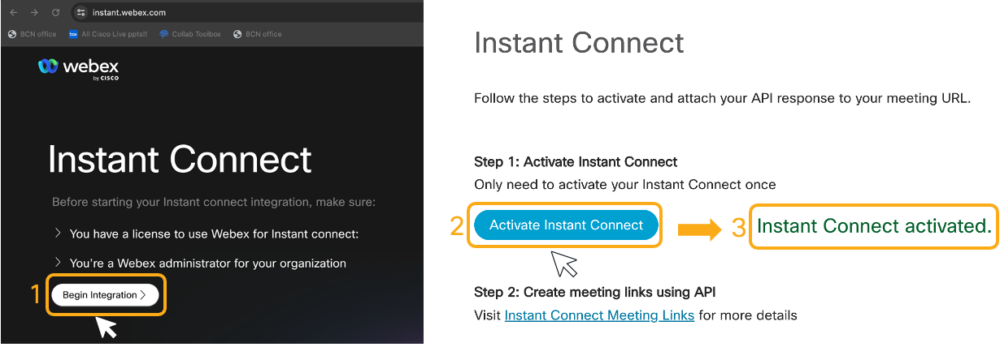
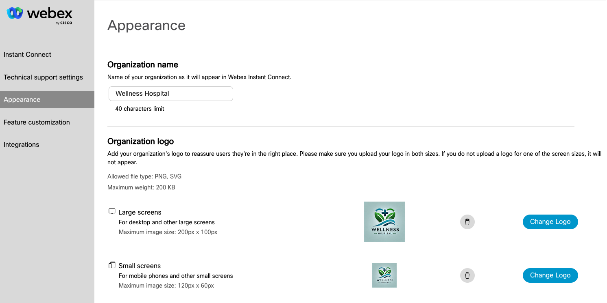

# Webex Instant Connect configuration

Log in https://instant.webex.com as a Webex administrator in your Webex ORG, and:

1. Click on **Begin Integration**

2. Click on **Activate Instant Connect**:

   

Now we are ready to learn how to use Webex Instant Connect API!

> Note: Remember that you need to use a Guest-to-Guest Webex Meeting site, as described in this lab Introduction

You can also configure Instant Connect appearance by adding your organization name and logo. For this healthcare example:

1. Go to **Appearance**, change the **Organization Name**. You can use, for example, 'Wellness Hospital'. 

2. Click on **Change Logo**, and use the pictures provided: [small](https://pubhub.devnetcloud.com/media/webex-connect-instant-connect/labs/images/hospital-logo-small.png) and [big](https://pubhub.devnetcloud.com/media/webex-connect-instant-connect/labs/images/hospital-logo-big.png).

   

3. Log in [Control Hub](https://admin.webex.com) as an administrator, and click on **Apps**

4. Select **Service Apps**, you should see a Service App named 'Instant Connect Service App' listed. Enable it by clicking on the **Authorize** toggle switch. If you have more than one webex site in your org, choose in what site you want to authorize the Service App

5. Click on **Save**