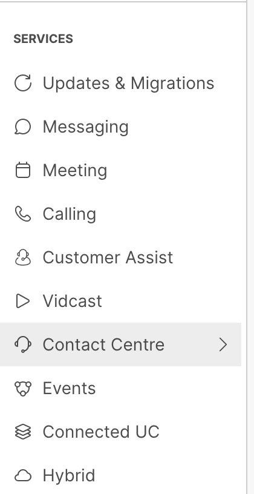

# Webex Connect Flow

The objective is to create a Webex Connect flow for this healthcare use case. To save you time, part of the workflow has already been created in advance. We will see how to add the most relevant functionalities, and we will do it in sections:

1. Introduction


PENDING TO FINISH

2. Create a new blank flow
3. Flow trigger
4. Welcome message
5. Surgery Reminder
6. Video Meeting Scheduling
7. Create and share Instant Connect Meeting Links
8. Update CRM

## Introduction

This is the interaction flow:

* Customer name is read from CRM
* Surgery date is generated
* Surgery reminder is sent
* Video Consultation is scheduled with an specialist. This process is handled by a Webex AI Autonomous Agent
* Video with instructions is sent to the customer
* Webex Instant Connect meeting links are created, and shared with the customer and the expert just before the meeting begins
* CRM is updated, indicating that the customer requested the video escalation, and the specialist chosen (DO I KEEP THIS ??)
* Customer and expert join the meeting

## Get Customer Data from CRM

1. Log in Control Hub with your admin user, go to **Services**, **Contact Center**:

    <p align="center">
    
    </p>

    In the **Quick Links** section on the right, click on **Webex Connect** 


2. Go to Services

   <p align="center">
   
   </p>

Select the Services for you POD, and click on the Service named '_Healthcare Main Flow_'

3. Add an **HTTP Request** node to the canvas, and connect it to the first Node **Configure Webhook** . We will use this node to retrieve the customer name from the customers data base.

    - For **Method** select: `GET`

   - For **Endpoint URL**, type: `$(crmAPIEndpoint)/customers/search/?mobileNumber=$(mobileNumber)&email=$(customerEmail)`
   This is an example of the use of Variables inside Connect. You can access easily access them in the **Input Variables**, **Custom Variables** section on the right

   - Configure your headers as in the following image

      
   
   where `x-pod-id` is your POD number, and `x-user-email`is the attendee email of your choice

   - Rename this http request node to something like 'Get Customer Name from CRM' and **Save**.


4. Add a **Data Parser** node, and connect it to the **HTTP Request Node**. This will allow you to parse the data received from the customer data base to be used later in any node in the flow.

   - For **Input: Import Data From**: under the **Input Variables** section to the right, select the `http.response.body` variable from the previous **HTTP Request** node 'Get Customer Name From' configured in the previous step:

    

    > **Note:** Node number may be different than shown above.

    - Now, we will populate **Sample Body (optional)** with some JSON that exemplifies the data we expect to be parsing.

        There are different ways to get such sample data. Usually, there are examples available on the documentation of the CRM/backend system you want to integrate with; or, you could use the 'Test' option of the http request node.
        
        Here, we will use this sample JSON:
         ```  
         {
            "podId":"POD4",
            "userEmail":"studentpod4@email.com",
            "adminMode":false,
            "searchCriteria": {
               "email":"customerpod4@email.com",
               "mobileNumber":"12225556666"
            },
            "searchScope":"user_customers",
            "matchingCustomers":[{
               "id":"791b0fe8-b5aa-4e18-8eb6-2076d3d20d8c",
               "name":"Customer Pod4",
               "email":"customerpod4@email.com",
               "phone":"",
               "mobileNumber":"12225556666",
               "company":"",
               "status":"active",
               "createdBy":"studentpod4@email.com",
               "createdAt":"2025-07-28T20:39:38.171Z",
               "updatedAt":"2025-07-28T20:39:38.171Z"
            }],
            "totalMatches":1,
            "totalSearched":1
         }
         ```
    
        (The actual key values are not important, and could be anything or even empty.) 
        
        Copy/paste the JSON into the **Sample Body (optional) / PROVIDE SAMPLE INPUT** field, and click **PARSE**.
        
        Under **SELECT OUTPUT VARIABLES**, choose `$.matchingCustomers[0].name` anc click **Import**
                
    - Go ahead and give this variable the 'Output Variable Name' `customerName`

        
        
    - Rename the node to 'Parse Response', and click on **Save**.

5. Let's learn now about a very powerful Webex Connect feature: how to modify variables.

- Double-click on this very same 'Parse Response' **Data Parser** node that we created, and select **Transaction Actions (Optional)**

- Add a new action
- Under **Action 1**, select:
   Time = `On-leave`
    
   Action = `Set variable`
   Variable: choose `customerName` abs as **Value** type `$(n101.customerName)`
   
   Note that the node numbers maybe different, and how you can access the output of this very same **Receive** node under **Output Variables**.

- Add another _On-leave_ Action, this time choose `[Debug] Log a Value to transaction log`. For the of `Log Id` you can use '1001', and `$(customerName)` for the value. This will help you troubleshooting the flow if needed.


   


Mission accomplished! Learn how to integrate Webex Connect with external databases

