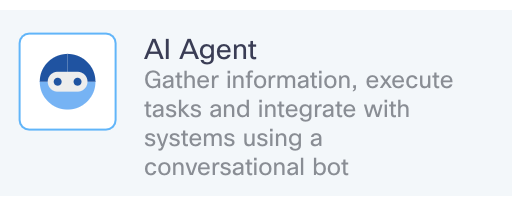
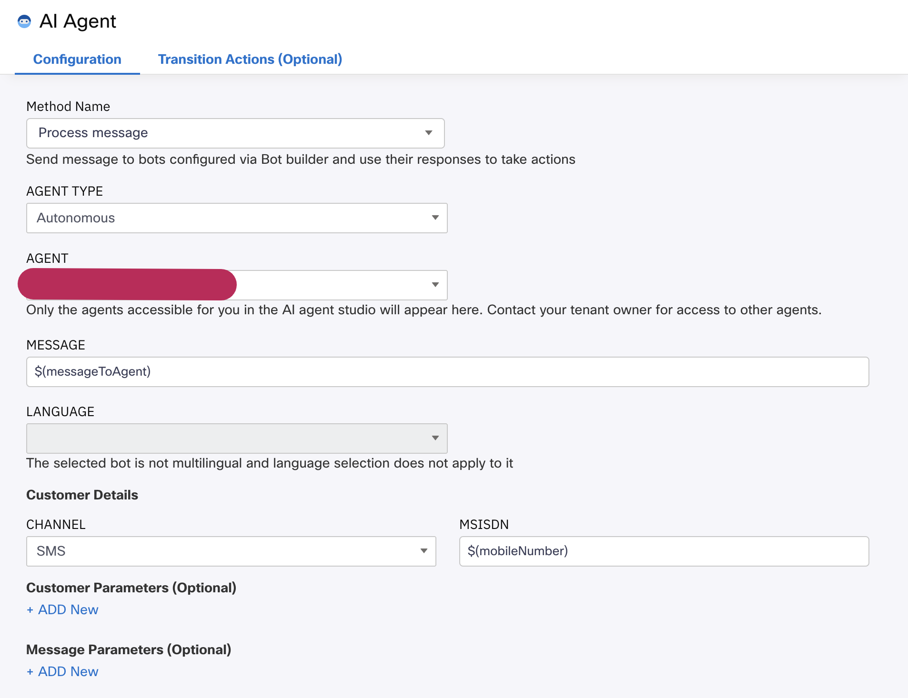
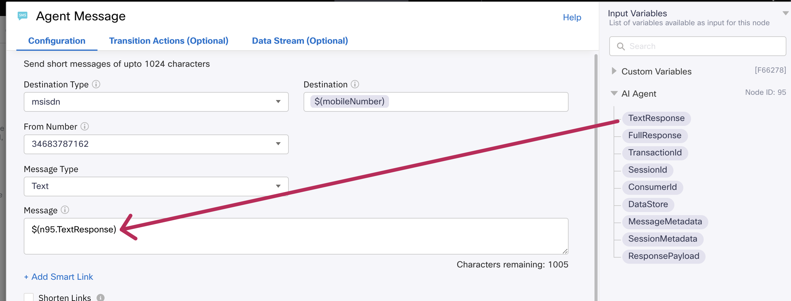
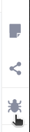
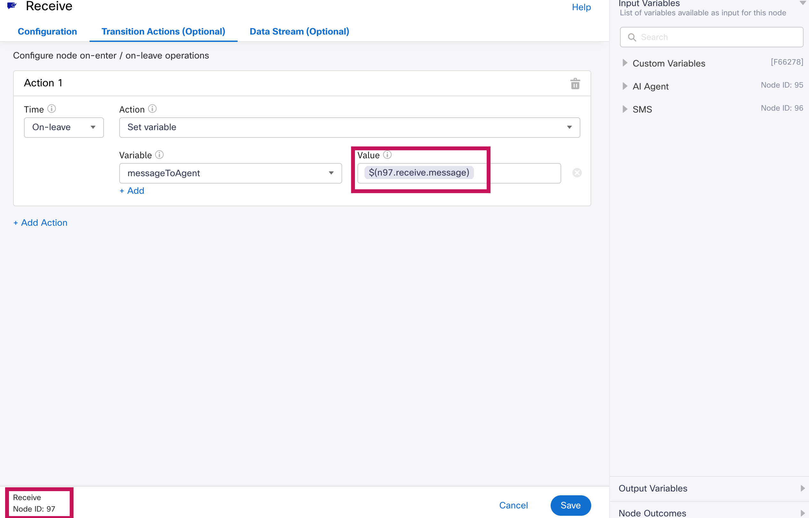
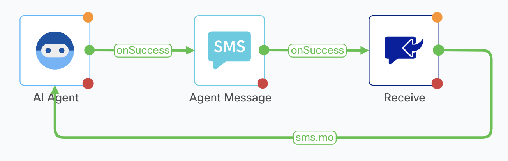
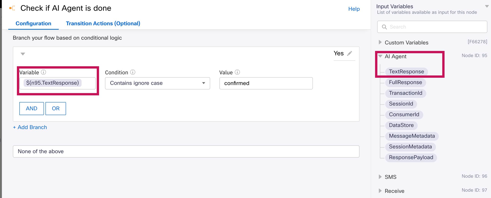
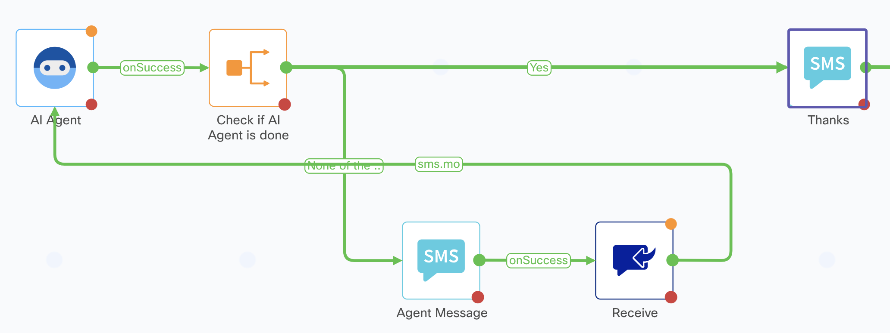
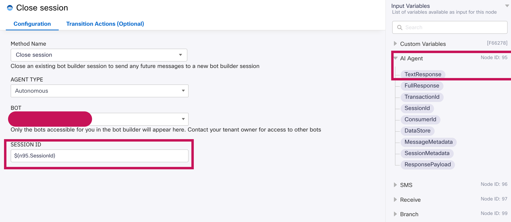
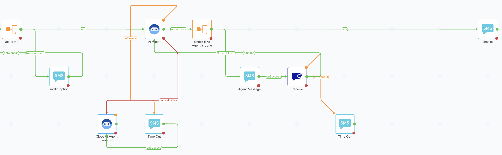

# Adding the Webex AI Agent to the main Flow

In this section you will learn how to add a Webex AI agent into any Connect Flow to serve digital channels. You will do it step by step to understand the process.

## AI Agent Node

1. Create a **Custom Variable**, name it _messageToAgent_ and choose _Hi_ as the **Default Value**

    You can configure your Custom Variables in Settings, on the top-right part of the screen:

    

2. Go the Node Pallette on the right side of teh screen, select the _AI Agent_ node:

    

        
    

    and add it to the Canvas. Connect it to the Branch Node named 'Yes or No'

3. Double click on the node to set it up:

    

    On the **AGENT** drop-down. menu, choose you the. AI Agent that you have created. Notice that with the _messageToAgent_ Custom Variable we will be triggering the Agent.

## Working with end customer messages

1. Now the next step is to send the response generated by the Agent and send it back to the customer.
    - Select any of the SMS Nodes that you already have in the flow, copy and paste it
    - Connect it to the AI Agent Node, choosing the _onSuccess_ **Event**
    - Double click on this new SMS Node to set it up
    - Rename it to something like _Agent Message_, and choose these values:

    

    Depending on the order you followed during the lab, what you see on the screen might be slightly different. Normally, you will see the AI Agent node as the last one in the list of nodes on the right. Remember that you can always check the node numbers by clicking the **Debug** button

    

        
    

2. Select any of the Receive nodes that you already have in the flow, copy and paste it. Connect it the 'Agent Message' previous SMS Node.

3. This Receive Node will get the end customer question/message. Now we need to send it back to the Agent. Double click the Receive Node, and add a Transaction Action like this

    

    Be sure that the variable node number (97 in this example in `$(n97.receive.message)` ) is the same as the Receive Node number at the bottom left. With this step, you are taking the customer SMS message text and sending it back to the AI Agent

4. Select the Receive Node Outcome (green circle), and connect it to the AI Agent Node. You should get something like this:

    

    If you tested now the Flow it would work, but the Flow would never go on, we need to add a way to determine that the Video visit was scheduled, and go on. You will do it now:

## Escaping the flow (RENAME!!)

1. Remove the connection between the AI Agent Node, and the 'Agent Message' SMS Node. You do this by selecting the connection and clicking on the Delete button on the bottom of the Flow Editor canvas.

2. Add a new Branch Node, connect it to the Agent AI Node, and configure it like this:

    

3. Connect the 'Check if AI Agent is done' Branch Node' to the existing SMS node named 'Thanks'. Choose the _Yes_ **Event**

4. Go back to the 'Check if AI Agent is done' Branch Node', and now connect the _None of the above_ **Event** to the 'Agent Message' SMS Node. Now this section of the Flow should look like something like this:

    

    As you can see, we didn’t build this section of the flow in the same order as the nodes appear now, but hopefully this helped you better understand the process.

    Now you only need to add error and time out control:

## Controlling response time outs and session errors

1. Select any of the existing 'Time Out' SMS nodes that you already have in the flow, copy and paste it. Connect it to the Orange output (On Timeout) of the Receive Node you recently added.

2. Paste one more 'Time Out' SMS node, and connect it to the Orange output (On Timeout) of the AI Agent Node

3. Add a new AI Agent Node to the Canvas. Connect all the previous AI Agent node Red outputs to this new AI Agent node (onInvalidData, onError, onInvalidChoice, onFailure). Double click on it to set it up:

    

4. Connect the last 'Time Out' SMS node that you created to this 'Closin Session' AI Agent Node

This section of the flow should look like this:

> NOTE: you could use only one Time Out Node if you wanted, we chose to have two to make the flow easier to follow

