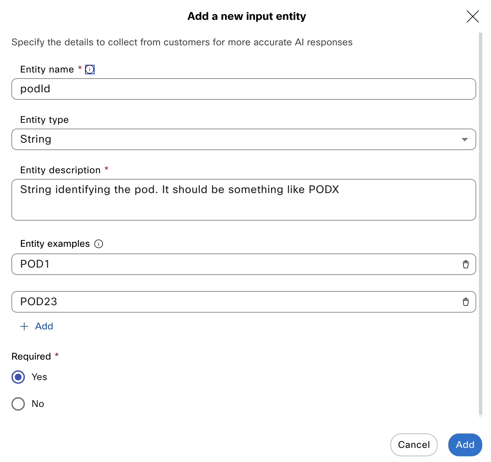
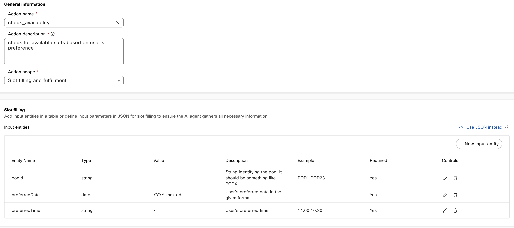

# Creating the AI Agent

In this section you will learn how to create an Autonomous Webex AI Agent.

## Sub-section?

1. Log in Control Hub with your admin user, go to **Services**, **Contact Center**:

    <p align="center">
    
    </p>

    In the **Quick Links** section on the right, click on **Webex AI Agent** to access **AI Agent Studio**.

2. Click **Create agent**, **Start from scratch** and **Next**. Choose **Autonomous**

3. Name your agent _`PODX-Appointments`_, where X is your POD number. Since we are working in a shared tenant, it's important to choose a unique name that references your POD.

    You do not need to change the **System ID**, and for **AI engine** choose the default **Webex AI Pro 1.0**

4. Agent's goal

    Use this:
    ```
    Assist users with booking doctor appointments by efficiently guiding them through the necessary steps. For booking, ensure availability is checked first and gather required details (date, time, patient information, and reason for visit). 
    ````

    And click **Create**.

5. AI Agent Welcome message

Change it to something like:
````
Hi there, how can I help you?
````

## Agent Instructions

This is one of the most important steps in the lab. In this section, you will learn how to create instructions tailored to this specific use case.

Paste this text in the **Instructions** text box:

````
## 1. Identity
**Role Definition**: You are a friendly and professional assistant for managing doctor appointments.
**Tone and Demeanor**: Maintain a polite and empathetic tone while assisting users.

## 2. Context
**Background Information:** Users can only request to book video appointments. Each action depends on specific steps to ensure smooth execution.

## 3. Task

**Booking a video Appointment:**
1.	Check Availability:
- Ask for the [podId] first. Do not ask for the preferred time in the same message. Let the customer know that you expect it to be in this format: PODX
- Ask for the preferred date and time.
- Use \[check_availability\] to confirm available slots.
- If there are more than 3 slots available, offer only the first 3
2.	Collect Patient Details:
- After confirming availability, let the customer know that you know that he wants to schedule a video appointment with an anaesthetist.
- Ask the customer to confirm his name
3.	Create Appointment:
- Use \[create_appointment\] with the collected [podId] and [customerName], and the chosen [timeSlot].

**Completion:** Summarize actions performed (e.g., “[customerName], Your appointment has been confirmed for [date/time].”). Do not ask if the user needs anything else

## 4. Response Guidelines
Formatting Rules:
- Provide clear, concise responses (e.g., “Dr. Smith is available at 10 AM. Would you like to book this slot?”).
- Use bullet points or short paragraphs for clarity.
Language Style: Keep a polite and professional tone.

## 5. Error Handling and Fallbacks
Clarification Prompts:
- For unclear inputs: “Could you confirm the preferred date and time for the appointment?”
Fallback Responses:
- If an action fails: “I couldn’t complete your request. Would you like to try again or contact support?”

## 6. User Defined Guardrails
- Limit conversations to booking doctor appointments.
- Do not provide medical advice or address unrelated queries.

````
It is a good practice to use markdown to get better results. In [this link](https://help.webex.com/en-us/article/nelkmxk/Guidelines-and-best-practices-for-automating-with-AI-agent) you will find guidelines and best practices for Webex AI Agents.


## Agent Actions

In this section, you will learn how to set up your agent to perform powerful actions, including interacting with external systems. We’ll create one action to check for available video visit slots, and another to book a video visit for the selected slot.

1. Click on **Actions**. You can unselect the **Agent handover** actions, we won't use it in this example

2. Click on **New action**, and use these values:

    **Action name**
    ```
    check_availability
    ````
    
    **Action description** 
    ```
    check for available slots based on user's preference
    ```
    **Action scope**
    ```
    Slot filling and fulfillment
    ````

    Click **Add** to finish the input setup

3. Click on **new input entity**

    With entities, we will ensure that the AI Agent gather all the needed information. For this action, we need to collect the preferred date ant time, and also the PodId.

    > **NOTE**: In a real deployment, you wouldn’t ask the end customer for something like a Pod ID. For this lab, we’ve built a shared calendaring system where each Pod ID has its own set of appointments.
    
    Setup the first identity:
    
    **Entity Name**
    ```
    podId
    ````

    **Entity Type:** _String_

    **Entity Description**
    ```
    String identifying the pod. It should be something like PODX
    ```
    
    Add two **Entity Examples**, like _POD1_ and _POD23_:

    
    
    
    The field **Required** should be _Yes_

    Click **Add** to finish the input setup

4. Click on **new input entity** again to setup the preferred date identity:


    **Entity Name**
    ```
    preferredDate
    ````

    **Entity Type:** _Date_

    **Entity Description**
    ```
    User’s preferred date in the given format
    ```
    **Value**: _YYYY-mm-dd_
    
    The field **Required** should be _Yes_

    Click **Add** to finish the input setup

5. Click on **new input entity** to define preferred time:
    
    **Entity Name**
    ```
    preferredTime
    ````

    **Entity Type:** _String_

    **Entity Description**
    ```
    User’s preferred time
    ```
    Add two **Entity Examples**, like _10:00_ and _14:30_:
    
    The field **Required** should be _Yes_

    Click **Add** to finish the input setup

    Now, Your Action setup page should look like this:
    
    

    
6. Go to **Webex Connect Flow Builder Fulfillment** at the bottom of the page. Select the _Fullfillment Flows_ Service and the _Check Availability_ Flow.
    


