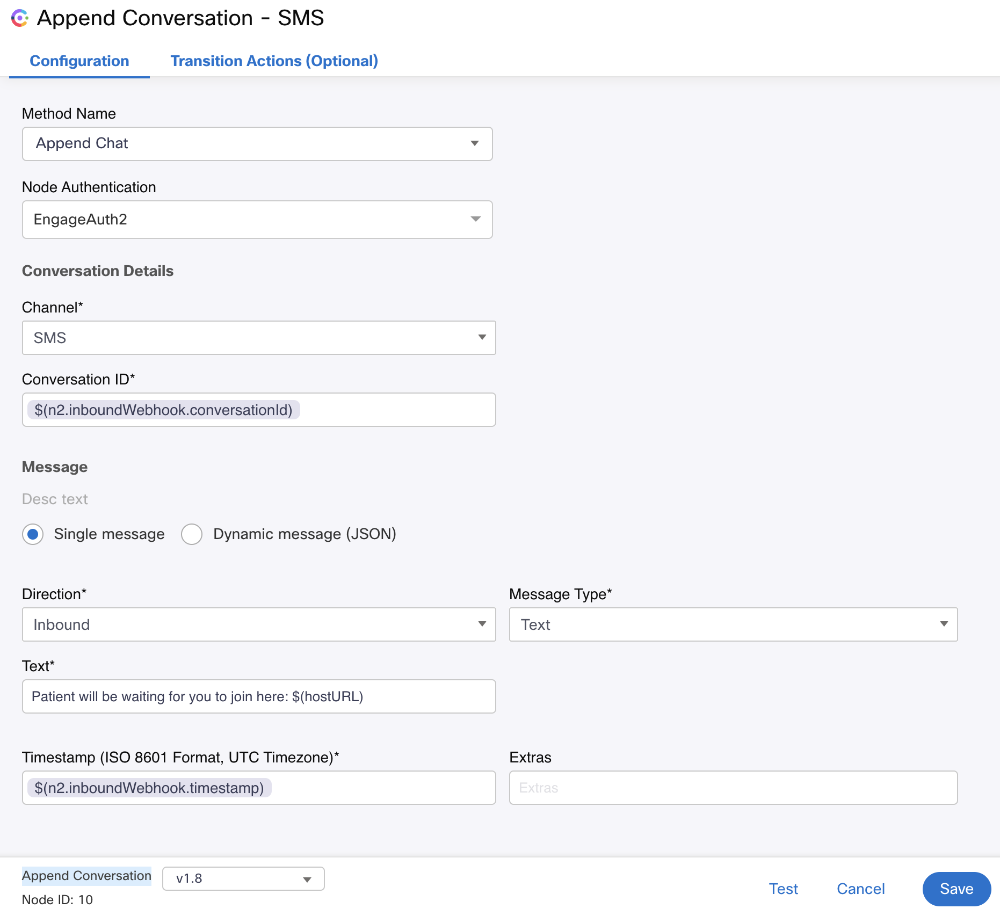
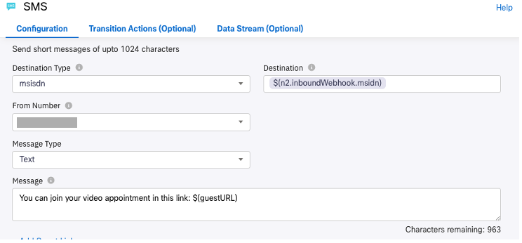
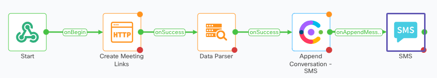
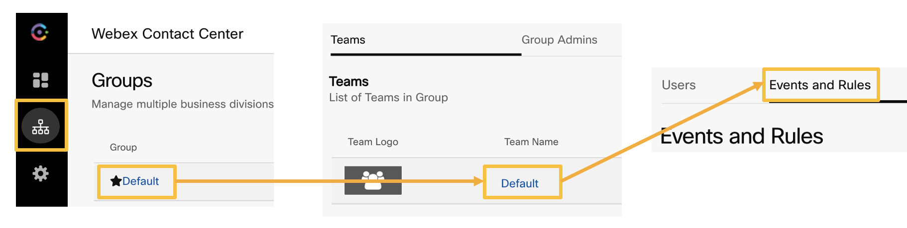
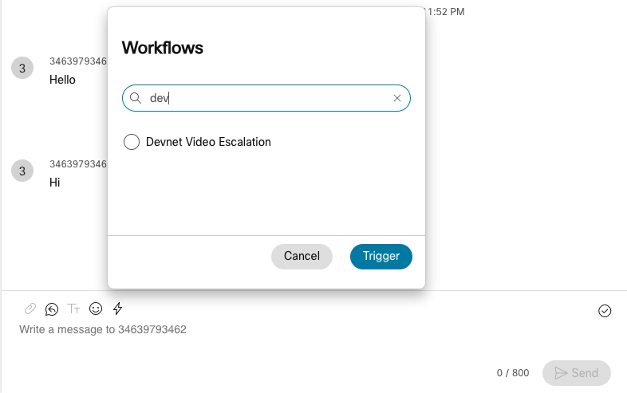

# Webex Contact Center integration

The objective is to enable Webex Contact Center (WxCC) agents to escalate digital channel conversations to video when needed. 

You need to setup: 

 1. A Webex Connect Flow
 2. A Webex Contact Center Event


## Pre-requisites

- Webex Contact Center tenant: You can get a developer sandbox for free at: https://developer.webex-cx.com/sandbox

## Webex Connect Flow

1. Log in to your Webex Connect tenant, go to Services, choose some of your existing services, or create a new one. Then click on **Flows**, **Create Flow**.

2. Give the flow a name, e.g.: `Instant Connect Event`

   - For **Method** select: `New Flow` and `Start from Scratch`

   - For **Trigger Category** select: `Webhook` in this case

3. Select **Create new event** and choose a **Name**, for example: `instant-connect-event`

4. Copy the **Webhook URL** and save the value, you will need it later

5. In the text box **Provide Sample Input**, type:

    ```
    {
    "conversationId": "id",
    "msidn":"123456789"
    }
    ```

6. Click on **Parse** and **Save**

7. Edit the node to something like `Start`

Now it's time to apply what you learnt in previous sections.

8. Create the following Custom Variables: 
    
    - _meeting-broker-url_: `https://mtg-broker-a.wbx2.com``
    - _botToken_: Use your bot token
    - _guestURL_ and _hostURL_

9. Add an **HTTP Request** and a **Data Parser** node to the Webex Connect canvas, and configure them to create the meeting links as you did in [this](https://developer.cisco.com/learning/labs/webex-connect-instant-connect/webex-connect-flow-share-ic-meeting-links/) section.
    
    Connect the **HTTP Request Node** to the first Start Node. 
    
    _guestURL_ and _hostURL_ variables will store the links to share with customer and expert.

10. Add an **Append Conversation** node and configure it:

    Select 'Append Chat' as **Method Name**, and your Engage Authentication for **Node Authentication**

    > NOTE: It is assumed that you already have WxCC configured for agents to handle digital channels. You can find detailed instructions in [this](https://webexcc.github.io/pages/Digital/) lab.

11. Type `$(n2.inboundWebhook.conversationId)`in **Conversation ID**

12. For the rest of parameters: 

    - **Direction** = _Inbound_
    - **Message Type** = Text
    - **Text*** = `Patient will be waiting for you to join here: $(hostURL)`
    - **Timestamp (ISO 8601 Format, UTC Timezone)*** = $(n2.inboundWebhook.timestamp)

    Always try to use the choose the last version of the Node in the **Append Conversation** drop-down menu.

    

    With this append node, you are automatically adding the message '`Patient will be waiting for you to join here: $(hostURL)`' into the agent desktop Interaction Pane

13. Click **Save**

14. Add an **SMS** Node to the canvas, and connect it to the **Data Parser** node.

    > NOTE: We are using SMS in this section because WhatsApp is not available on the WxCC developer sandboxes. If you have access to a Webex Connect tenant with WhatsApp, you can use a WhatsApp node instead. The rest of the flow would be identical.

15. Double-click on it, and edit:

    - **Destination Type** = msidn
    - **Destination** = `$(n2.inboundWebhook.msidn)`
    - **From Number** = Choose you tenant/sandbox SMS origin number
    - **Message** = `You can join your video appointment in this link: $(guestURL)`

    

    With this **SMS Node**, you will be sending the guest link to join the meeting to the customer

16. **Save** and Publish the Flow, it should look like this:

    

## Webex Contact Center Event

Events can be manually fired by agents anytime during a conversation.

1. Log in [Control Hub](https://admin.webex.com) as a Contact Center administrator

2. Under **SERVICES**, choose **Contact Center**, and then **Webex Engage**

3. Now click on **Groups**, **Default**, **Default**, and select **Events and Rules**

    

4. Add a new Event, and give it a name, for example `Devnet Video Escalation`

5.  Configure it with the following values:

    - **Method**: `POST`
    - **URL**: Paste here the Webhook URL you created earlier here
    - **Expected Response Format**: `JSON`

6. For the **Payload**, select **Custom Payload**, and then use:

    ```
    {
    "conversationId": "@@chat id@@",
    "msidn":"@@customer mobile no@@"
    }
    ````
    for the raw data.

7. Add a `Content-Type`= `application/json` header, and **Save**

    Now, when the agent clicks on the **Trigger Workflow** option on the Desktop Agent, the new Event can be Triggered ('Devnet Video Escalation' in this example'):

    

You can find a demo video in the [Appendix section](https://developer.cisco.com/learning/labs/webex-connect-instant-connect/apendix/
).

You can download a working version of the flow in the same Appendix section too.


